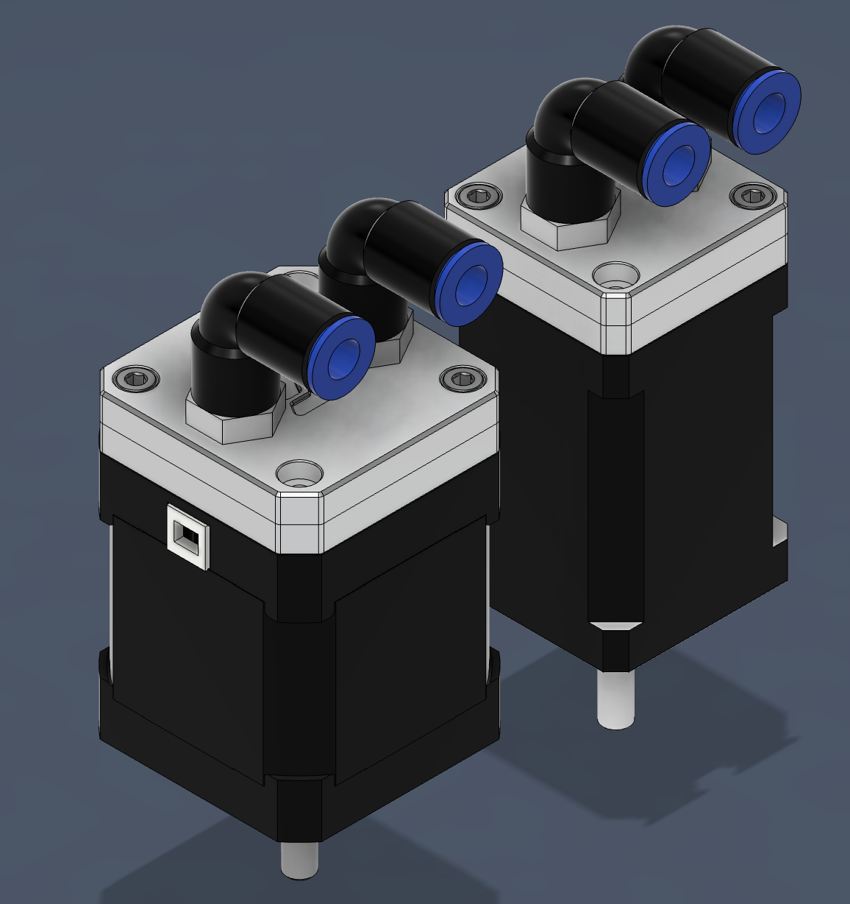
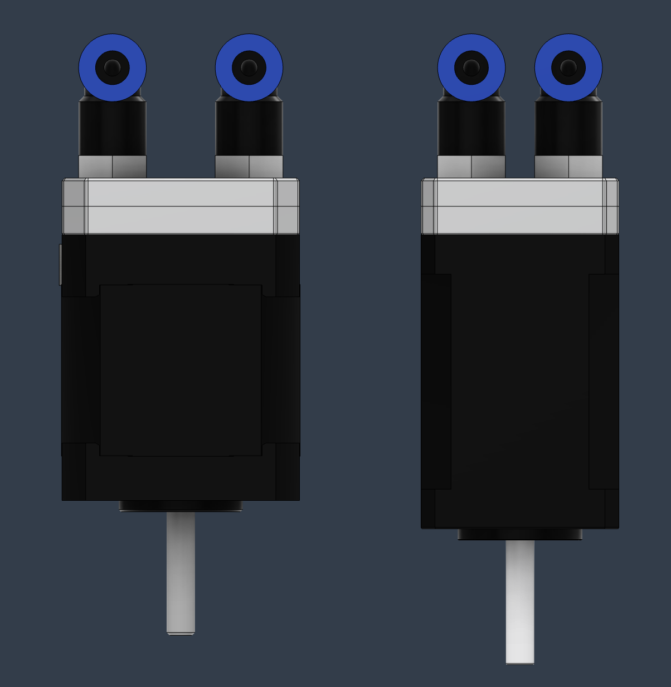

# KIC - Keep it Cool

Aluminum CNC blocks for wather cooling Nema 17s and 14s. 

  

  

## BOM

- 2x M5 Pneumatic fittings
- 2x M3x6mm SHCS (for holding the blocks together)
- 2x M3xX SHCS (for holding the blocks to the stepper motor)

